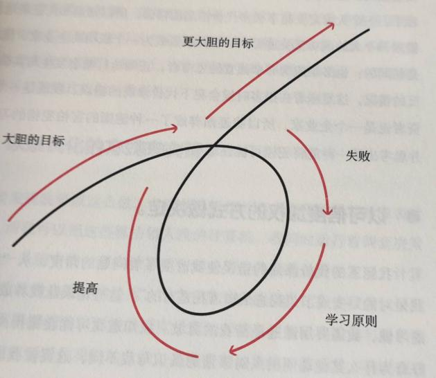
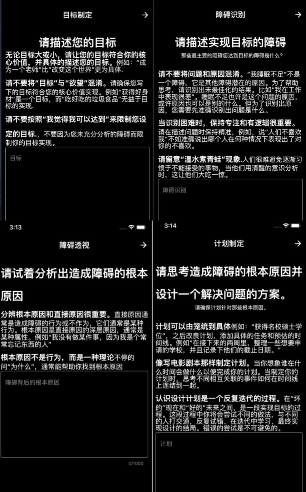
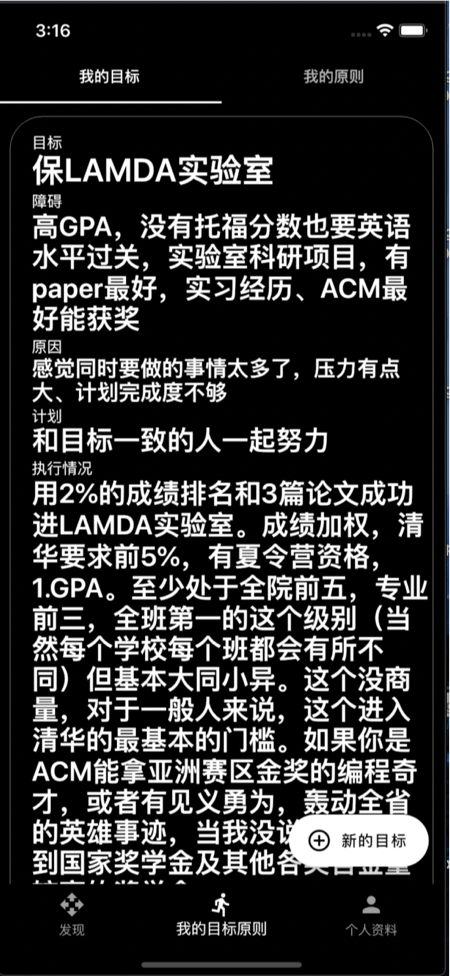
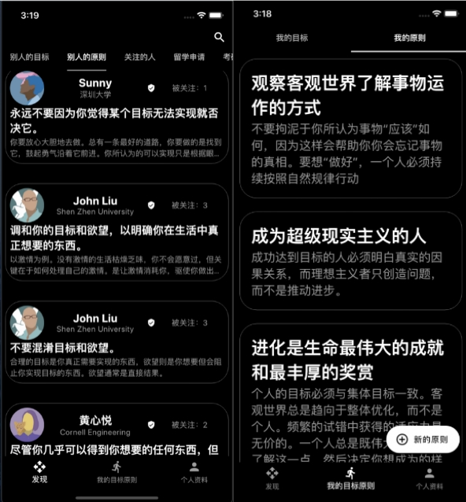
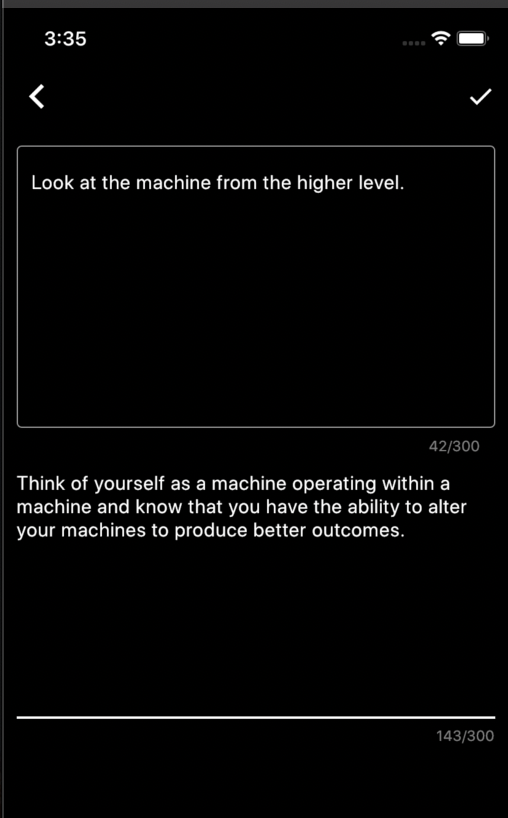
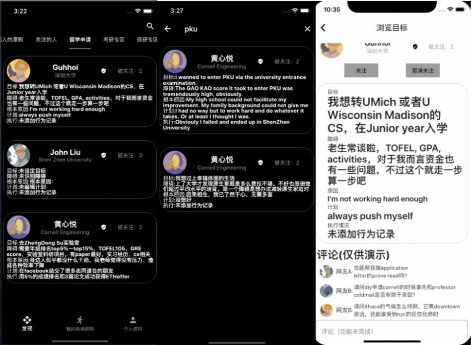
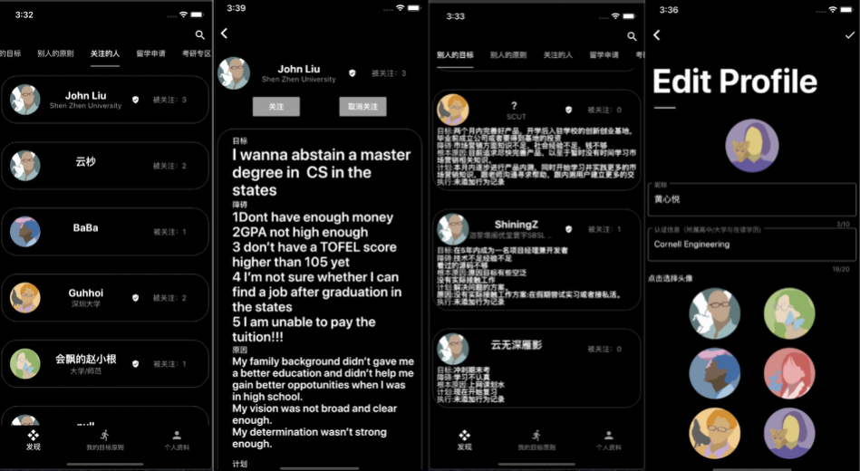

# CThrough 
# 软件设计大赛时的设计稿：
# Design during the software design competition:

（写于2020年5月，很不成熟。）
(Written in May 2020, very immature.)

## 1 项目初衷:
## 1 The original intention of the project:

在2020年5月参加程序设计比赛时，这个项目的名字是CThrough- 一款移动端个人决策辅助系统。主要功能是通过帮助用户在指导性文字的提示下理性思考，制定出自己的目标并且对目标进行障碍分析和计划制定、执行情况记录。我们还提供了分享功能让用户可以看到别人的目标和对目标的分析。用户可以把目标按照标签进行分类，变成如保研、考研、留学等板块方便其他用户参考和借鉴。同时又提供了“原则”的记录和分享功能（我们发现Principles in Action by Ray Dalio只在美区app store可用，而其功能之一便是记录原则）。

When participating in the programming competition in May 2020, the name of this project was CThrough-a mobile personal decision-making assistance system. The main function is to help users think rationally under the prompts of instructive texts, formulate their own goals, and conduct obstacle analysis, plan formulation, and execution records of the goals. We also provide a sharing function so that users can see other people’s goals and analyze them. Users can categorize targets according to tags and turn them into sections such as postgraduate entrance examination, postgraduate entrance examination, and study abroad for other users' reference and reference. At the same time, it also provides "principles" recording and sharing functions (we found that Principles in Action by Ray Dalio is only available in the US app store, and one of its functions is recording principles).

我们想用这个app的平台提供一种硬核的理性驱动的工具类社交平台，能促进用户的自我成长。我们希望用户在 CThrough 能够深思熟虑地思考自己所追寻地目标究竟是什么，并且一旦认清目标，不遗余力地去实现它，赢得自己向往的人生。 我们希望能提供用户按照参考反思自我的契机，并试图使广泛观察对比别人的思考成为可能，我们想要帮助用户成为尼采所构思的Übermensch。这是我们希望能为用户提供的价值。 

We want to use this app platform to provide a hard-core, rational-driven tool-based social platform that can promote the self-growth of users. We hope that users at CThrough can think carefully about what the goal they are pursuing is, and once they recognize the goal, they will spare no effort to achieve it and win the life they yearn for. We hope to provide users with an opportunity to reflect on themselves based on reference, and try to make it possible to observe and compare other people's thinking widely. We want to help users become the Übermensch conceived by Nietzsche. This is the value we hope to provide users.

“人与人的交往多半肤浅，或只有在较为肤浅的层面上，交往才是容易的，一旦走进深处，人与人就是相互的迷宫。” ——史铁生

"Interactions between people are mostly superficial, or only on a superficial level, communication is easy. Once you walk into the depths, people are mutual labyrinths."-Shi Tiesheng

## 2 市场需求分析:
## 2 Market analysis:

在互联网的后下沉阶段，社群对网上内容价值贡献的降低、社交媒体对个人成长促进作用愈加模糊，在如今的社会经济内部矛盾愈发显著、广大青年一代队前途愈发迷茫的今天、对未来有所谋划的年轻人迫切需要一个高质量的、非 KOL 主导的人生经历、乃至人生见解分享展示平台。 

In the post-sinking stage of the Internet, the contribution of the community to the value of online content has decreased, and the role of social media in promoting personal growth has become more and more obscure. Young people who have plans for the future urgently need a high-quality, non-KOL-led life experience, and even life insight sharing and display platform.

##  3服务提供和目标用户:
## 3 Service provision and target users:

下至面对极大高考和人生压力的高中生、上至刚进入职场、对未来仍感到迷茫、需要朋辈沟通交流的年轻人。 

From high school students who face great college entrance examinations and life pressures to young people who have just entered the workplace, who are still confused about the future and need peer communication.

## 4 主要功能和使用场景:
## 4 Main functions and usage scenarios:

1 总体介绍:在 Ray Dalio2017 年书 Principles: Life and Work,中提到了实现一个目标哲学上的分解:1 设定目标 2 失败 3 学习原则 4 提高(实现目标)5 更 大胆的目标。 

1 General introduction: In Ray Dalio's 2017 book Principles: Life and Work, the philosophical decomposition of achieving a goal is mentioned: 1 set goals 2 fail 3 learn principles 4 improve (achieve goals) 5 bolder goals.

在 CThrough 中，我们采取类似的方法论指导，将目标的实现过程分解为 5 步:制定目标、分析目标实现的障碍、分析造成障碍根本原因、制定消除障碍的 计划、执行计划。用户在应用中每创建一个目标，都会在反复的提醒下进行这个 步骤中的前四步、当有所行动后，可以返回 CThrough 记录。 

In CThrough, we adopt similar methodological guidance to decompose the goal realization process into 5 steps: formulate goals, analyze obstacles to goal realization, analyze root causes of obstacles, develop plans to eliminate obstacles, and execute plans. Every time the user creates a goal in the application, he will perform the first four steps of this step under repeated reminders, and when he takes action, he can return to the CThrough record.

其次，在 Principles 一书中，作者提到人应该使用原则来简化决策步骤、将从以往经验中获得的原则直接运用于今后的决策中、为此，CThrough 提供了原则记录和分享功能，可以创建自己的原则，查看自己的原则列表，看到别人的原则: 

Secondly, in the book Principles, the author mentions that people should use principles to simplify decision-making steps, and apply the principles gained from past experience directly to future decision-making. For this reason, CThrough provides principle recording and sharing functions, which can create Your own principles, check your own list of principles, and see the principles of others:

1 每个设定的目标都对应了一个标签，可以用于搜索，而“留学”、“保研”、“考研”三个标签由于最受关注，所以会自动显示在发现页面:

1 Each set goal corresponds to a label, which can be used for searching. The three labels of "study abroad", "guarantee research" and "postgraduate entrance examination" are the most concerned, so they will be automatically displayed on the discovery page:

通过发现页面顶部的搜索按钮可进进入搜索页面，服务器会返回所有此标签下的目标。点击某个目标，可以查看详情（并且阅读评论、添加评论（未实现）) 
如果对某个用户特别有兴趣， 可以使用关注功能。被关注的用户会显示在发现页上。 

You can enter the search page through the search button at the top of the discovery page, and the server will return all targets under this label. Click on a goal, you can view the details (and read comments, add comments (haven't been implemented))
If particularly interested in a certain user, users can use the follow function. Followed users will be displayed on the discovery page.

(1)发现界面:用户可以在发现界面查看最新的其他用户制定的目标 

(1) Discovery interface: Users can view the latest goals set by other users in the discovery interface

(2) 用户个人信息界面:用户可以更改自己的昵称和身份来让大家更好地认识就自己。 

(2) User personal information interface: Users can change their nickname and identity to let everyone know themselves better.

其他界面:
CThrough 目前采用邮箱验证方式注册用户 

Other interfaces:
CThrough currently uses email verification to register users
 

##  6 盈利模式展望:
## 6 Profit model outlook:

(1)通过在平台上的用户互动积累人气，推送其他人同类别相似目标是如何被分析、制定计划、完成的。将平台打造成带有 C2C 付费/免费目标导向的咨询属性的范社交平台。 

(1) Accumulate popularity through user interaction on the platform, and push how other people's similar goals in the same category are analyzed, planned, and completed. Build the platform into a social platform with C2C paid/free goal-oriented consulting attributes.

